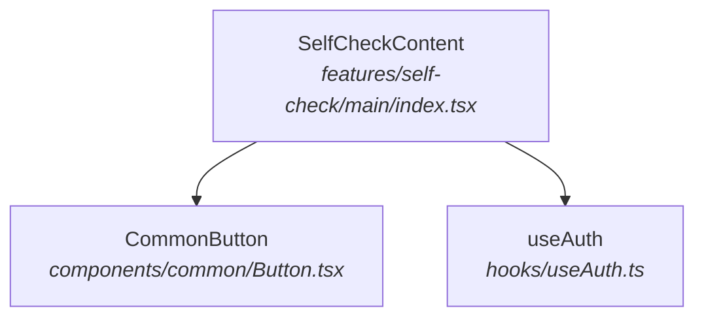

# Obsidian Plugin 개발 가이드

> Mermaid-to-VSCode Linker 플러그인 기준으로 작성

---

## 1. 초기 세팅

### 1-1. 프로젝트 초기화

```bash
cd /Users/hyojin/Desktop/jinlee/project/obsidian-plugin

# Node.js 프로젝트 초기화
npm init -y

# 필수 의존성 설치
npm install --save-dev obsidian @types/node typescript esbuild builtin-modules
```

### 1-2. package.json 스크립트 설정

```json
{
  "scripts": {
    "dev": "node esbuild.config.mjs",
    "build": "node esbuild.config.mjs production"
  }
}
```

### 1-3. manifest.json

Obsidian이 플러그인을 인식하는 메타데이터 파일. **프로젝트 루트**에 생성한다.

```json
{
  "id": "mermaid-vscode-linker",
  "name": "Mermaid VSCode Linker",
  "version": "1.0.0",
  "minAppVersion": "0.15.0",
  "description": "Mermaid 다이어그램 노드 클릭 시 VS Code에서 소스코드 열기",
  "author": "jinlee",
  "isDesktopOnly": true
}
```

> `isDesktopOnly: true` — 이 플러그인은 `child_process`(exec)를 사용하므로 데스크톱 전용

### 1-4. tsconfig.json

```json
{
  "compilerOptions": {
    "baseUrl": ".",
    "inlineSourceMap": true,
    "inlineSources": true,
    "module": "ESNext",
    "target": "ES6",
    "allowJs": true,
    "noImplicitAny": true,
    "moduleResolution": "node",
    "importHelpers": true,
    "isolatedModules": true,
    "strictNullChecks": true,
    "lib": ["DOM", "ES5", "ES6", "ES7"]
  },
  "include": ["**/*.ts"]
}
```

### 1-5. esbuild.config.mjs

```js
import esbuild from "esbuild";
import process from "process";
import builtins from "builtin-modules";

const prod = process.argv[2] === "production";

const context = await esbuild.context({
  entryPoints: ["main.ts"],
  bundle: true,
  external: [
    "obsidian",
    "electron",
    "@codemirror/autocomplete",
    "@codemirror/collab",
    "@codemirror/commands",
    "@codemirror/language",
    "@codemirror/lint",
    "@codemirror/search",
    "@codemirror/state",
    "@codemirror/view",
    "@lezer/common",
    "@lezer/highlight",
    "@lezer/lr",
    ...builtins,
  ],
  format: "cjs",
  target: "es2018",
  logLevel: "info",
  sourcemap: prod ? false : "inline",
  treeShaking: true,
  outfile: "main.js",
});

if (prod) {
  await context.rebuild();
  process.exit(0);
} else {
  await context.watch();
}
```

### 1-6. 최종 프로젝트 구조

```
obsidian-plugin/
├── main.ts                # 플러그인 진입점
├── settings.ts            # 설정 탭
├── styles.css             # 스타일
├── manifest.json          # 플러그인 메타데이터
├── package.json
├── tsconfig.json
├── esbuild.config.mjs
├── main.js                # 빌드 결과물 (gitignore 대상)
├── PLAN.md
└── DEV_GUIDE.md           # 이 문서
```

---

## 2. 개발 워크플로우

### 2-1. 심볼릭 링크로 플러그인 연결

빌드 결과물을 Obsidian 보관함의 플러그인 폴더에 심볼릭 링크로 연결한다.
매번 파일을 복사할 필요 없이, 빌드하면 즉시 반영된다.

```bash
# 플러그인 디렉토리 생성
VAULT_PLUGINS="/Users/hyojin/Desktop/wowfit/wowfit-architecture/wowfit/.obsidian/plugins"
PLUGIN_DIR="$VAULT_PLUGINS/mermaid-vscode-linker"
mkdir -p "$PLUGIN_DIR"

# 필요한 파일들을 심볼릭 링크
ln -sf "$(pwd)/main.js" "$PLUGIN_DIR/main.js"
ln -sf "$(pwd)/manifest.json" "$PLUGIN_DIR/manifest.json"
ln -sf "$(pwd)/styles.css" "$PLUGIN_DIR/styles.css"
```

### 2-2. 개발 모드 실행

```bash
npm run dev
```

- esbuild가 watch 모드로 실행되어 `main.ts` 변경 시 자동으로 `main.js`를 재빌드
- 심볼릭 링크를 통해 Obsidian 플러그인 폴더에 즉시 반영

### 2-3. Obsidian에서 변경사항 반영

코드를 수정한 후 Obsidian에 반영하는 방법:

| 방법                                      | 설명                                   |
| ----------------------------------------- | -------------------------------------- |
| **Cmd + P → "Reload app without saving"** | Obsidian 전체 리로드 (확실하지만 느림) |
| **커뮤니티 플러그인 → 토글 OFF/ON**       | 플러그인만 재시작                      |
| **Hot Reload 플러그인 사용 (권장)**       | 파일 변경 감지 시 자동 리로드          |

#### Hot Reload 플러그인 설치 (권장)

1. [pjeby/hot-reload](https://github.com/pjeby/hot-reload) 플러그인을 수동 설치
2. 플러그인 폴더에 `.hotreload` 파일 생성:
   ```bash
   touch "$PLUGIN_DIR/.hotreload"
   ```
3. 이제 `npm run dev`로 빌드하면 Obsidian이 자동으로 플러그인을 리로드

### 2-4. 디버깅

Obsidian은 Electron 기반이므로 Chrome DevTools를 사용할 수 있다.

```
Cmd + Option + I  →  개발자 도구 열기
```

- **Console 탭**: `console.log` 출력 확인
- **Elements 탭**: Mermaid SVG DOM 구조 확인
- **Network 탭**: 외부 요청 디버깅
- **Sources 탭**: 브레이크포인트 설정 (sourcemap 활성화 시)

---

## 3. 테스트

이 부분은 개발이 모두 끝난 후 적용 예정

### 3-1. 수동 테스트 체크리스트

Obsidian에서 아래 항목들을 직접 확인한다.

#### 기본 동작

- [ ] Mermaid 다이어그램이 정상 렌더링되는가
- [ ] `<i>` 태그 내 파일 경로가 감지되는가
- [ ] 클릭 시 VS Code에서 파일이 열리는가
- [ ] 클릭 가능 노드에 호버 스타일이 적용되는가

#### 설정

- [ ] 설정 탭에서 basePath를 변경할 수 있는가
- [ ] 설정 변경 후 즉시 반영되는가
- [ ] Obsidian 재시작 후에도 설정이 유지되는가

#### 엣지 케이스

- [ ] 존재하지 않는 파일 경로 클릭 시 알림이 뜨는가
- [ ] `diagram-zoom-drag` 플러그인과 충돌 없이 동작하는가
- [ ] 다크 모드 / 라이트 모드 모두에서 스타일이 정상인가
- [ ] `<em>` 태그 (마크다운 _italic_)로 작성된 경로도 감지되는가
- [ ] sequenceDiagram participant에서도 경로 감지가 되는가

#### 테스트용 Mermaid 코드 예시

````markdown

````

### 3-2. 자동화 테스트 (선택)

플러그인의 핵심 로직(파일 경로 감지)은 순수 함수로 분리하면 단위 테스트가 가능하다.

```bash
npm install --save-dev jest @types/jest ts-jest
```

```typescript
// __tests__/pathDetection.test.ts
import { extractFilePath } from "../utils";

describe("extractFilePath", () => {
  it("features 경로를 감지한다", () => {
    const text = "SelfCheckContent features/self-check/main/index.tsx";
    expect(extractFilePath(text)).toBe("features/self-check/main/index.tsx");
  });

  it("components 경로를 감지한다", () => {
    const text = "Button components/common/Button.tsx";
    expect(extractFilePath(text)).toBe("components/common/Button.tsx");
  });

  it("경로가 없으면 null을 반환한다", () => {
    expect(extractFilePath("일반 텍스트")).toBeNull();
  });
});
```

---

## 4. 빌드 및 배포

### 4-1. 프로덕션 빌드

```bash
npm run build
```

빌드 결과물:

- `main.js` — 번들링된 플러그인 코드 (sourcemap 미포함)

### 4-2. 배포 파일 구성

Obsidian 플러그인 배포에 필요한 파일은 **3개**:

```
main.js          # 빌드된 JS
manifest.json    # 플러그인 메타데이터
styles.css       # 스타일 (선택)
```

### 4-3. 수동 배포 (개인 사용)

다른 보관함이나 다른 PC에서 사용하려면:

```bash
# 대상 보관함의 플러그인 폴더에 복사
TARGET_VAULT="/path/to/vault/.obsidian/plugins/mermaid-vscode-linker"
mkdir -p "$TARGET_VAULT"
cp main.js manifest.json styles.css "$TARGET_VAULT/"
```

Obsidian에서:

1. 설정 → 커뮤니티 플러그인 → "제한된 모드" 해제
2. 설치된 플러그인 목록에서 "Mermaid VSCode Linker" 활성화

### 4-4. GitHub 릴리스 배포

이 부분은 개발이 모두 끝난 후 적용

다른 사람에게 배포하거나, Obsidian BRAT 플러그인을 통해 설치할 수 있다.

#### 1) GitHub 저장소 준비

```bash
git init
git add main.ts settings.ts styles.css manifest.json package.json tsconfig.json esbuild.config.mjs
git commit -m "Initial commit"
git remote add origin https://github.com/<username>/obsidian-mermaid-vscode-linker.git
git push -u origin main
```

`.gitignore` 에 추가할 항목:

```
node_modules/
main.js
```

#### 2) GitHub Release 생성

```bash
# 버전 태그
git tag -a 1.0.0 -m "v1.0.0"
git push origin 1.0.0

# GitHub CLI로 릴리스 생성
gh release create 1.0.0 main.js manifest.json styles.css \
  --title "v1.0.0" \
  --notes "Initial release"
```

#### 3) BRAT을 통한 설치 (베타 배포)

1. 사용자가 Obsidian에서 [BRAT](https://github.com/TfTHacker/obsidian42-brat) 플러그인 설치
2. BRAT 설정 → "Add Beta Plugin" → GitHub 저장소 URL 입력
3. 자동으로 최신 릴리스에서 `main.js`, `manifest.json`, `styles.css`를 다운로드

### 4-5. Obsidian 공식 커뮤니티 플러그인 등록 (선택)

공식 등록을 원하면:

1. [obsidian-releases](https://github.com/obsidianmd/obsidian-releases) 저장소에 PR 제출
2. `community-plugins.json`에 플러그인 정보 추가
3. Obsidian 팀의 코드 리뷰 통과 필요
4. 승인 후 Obsidian 앱 내 "커뮤니티 플러그인" 검색에 노출

> 공식 등록 시 `isDesktopOnly: true`이면 모바일에서는 검색되지 않는다.

---

## 5. 유용한 명령어 요약

| 명령어             | 설명                            |
| ------------------ | ------------------------------- |
| `npm run dev`      | watch 모드로 개발 (자동 재빌드) |
| `npm run build`    | 프로덕션 빌드                   |
| `Cmd + Option + I` | Obsidian 개발자 도구            |
| `Cmd + P → Reload` | Obsidian 리로드                 |

---

## 6. 참고 자료

- [Obsidian Plugin API 공식 문서](https://docs.obsidian.md/Plugins)
- [Obsidian Sample Plugin (공식 템플릿)](https://github.com/obsidianmd/obsidian-sample-plugin)
- [Hot Reload 플러그인](https://github.com/pjeby/hot-reload)
- [BRAT 플러그인](https://github.com/TfTHacker/obsidian42-brat)
